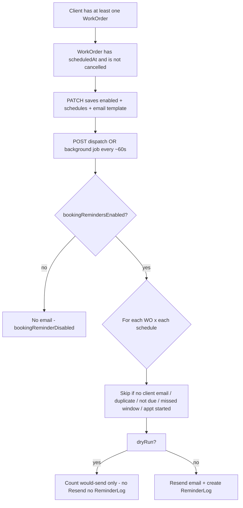

# Booking confirmation reminders — full flow and API testing guide

This document is for **end-to-end testing**: what to call, with what body, what comes back, and **how to tell if a real email was sent** (vs dry run, vs skipped).

**Base URL:** `http://localhost:<PORT>/api/...`
The server default is port **8080** unless you set `PORT` or `PORT_NO` in `.env` (check the console when you run `bun run dev`). Examples below use `http://localhost:8080` — change the port to match your machine.

**Auth:** All routes require a logged-in user. Send the session cookie your app uses after sign-in, or a bearer token if your client sends `Authorization: Bearer <token>`. Without auth you get `401`.

**Permissions:**

| Endpoint | Required permission |
| --- | --- |
| GET `/api/settings/booking-confirmation-reminders` | `settings` **read** |
| GET `/api/settings/booking-confirmation-reminders/template-variables` | `settings` **read** |
| PATCH `/api/settings/booking-confirmation-reminders` | `settings` **update** |
| POST `/api/settings/booking-confirmation-reminders/dispatch` | `settings` **update** |

**Standard success envelope** (all four endpoints use this pattern on success):

```json
{
  "message": "<human-readable string>",
  "success": true,
  "data": { }
}
```

Errors typically look like `{ "message": "..." }` with status `401`, `403`, `404`, or `500`.

---

## Request body schemas (authoritative)

These match `src/routes/settings/settings.routes.ts` (Zod). Use **exact** property names (`timeOfDay`, not `timeOfDays`).

### GET `/api/settings/booking-confirmation-reminders`

- **Body:** none
- **Query:** none

### GET `/api/settings/booking-confirmation-reminders/template-variables`

- **Body:** none
- **Query:** none

### PATCH `/api/settings/booking-confirmation-reminders`

**Content-Type:** `application/json`
**Body:** required object:

| Field | Type | Required | Rules |
| --- | --- | --- | --- |
| `enabled` | boolean | yes | Master toggle. |
| `schedules` | array | yes | May be `[]` (removes all schedule rows). Each item: |
| `schedules[].id` | string | no | Omit on create; optional when updating (IDs are reassigned on full replace anyway). |
| `schedules[].timeValue` | integer | yes | `1` … `720` |
| `schedules[].timeUnit` | string | yes | `"hours"` or `"days"` |
| `schedules[].timeOfDay` | string \| null | no | For `days`: e.g. `"02:30 PM"` or `"14:30"`. For `hours`: omit or `null`. |
| `schedules[].enabled` | boolean | no | Defaults to `true` if omitted. |
| `template` | object | yes | |
| `template.subject` | string | yes | Min length `1` |
| `template.message` | string | yes | Min length `1` |

**Valid — one schedule, 1 hour before (email):**

```json
{
  "enabled": true,
  "schedules": [
    {
      "timeValue": 1,
      "timeUnit": "hours",
      "enabled": true
    }
  ],
  "template": {
    "subject": "Scheduled reminder: Booking confirmation Reminders",
    "message": "Hi {client_name},\n\nReminder about your upcoming appointment.\n\nThanks,\n{business_name}"
  }
}
```

**Valid — hours + one day-based row with wall-clock time:**

```json
{
  "enabled": true,
  "schedules": [
    {
      "timeValue": 1,
      "timeUnit": "hours",
      "enabled": true
    },
    {
      "timeValue": 1,
      "timeUnit": "days",
      "timeOfDay": "02:30 PM",
      "enabled": true
    }
  ],
  "template": {
    "subject": "Scheduled reminder: Booking confirmation Reminders",
    "message": "Hi {client_name},\n\nSee you soon.\n\n{business_name}"
  }
}
```

### POST `/api/settings/booking-confirmation-reminders/dispatch`

**Content-Type:** `application/json`
**Body:** required JSON object; **may be empty `{}`** (schema applies `.default({})` so omitted keys behave as below).

| Field | Type | Required | Rules |
| --- | --- | --- | --- |
| `asOf` | string | no | ISO 8601 datetime. Evaluation “now” for due/missed logic. **Omit** to use real server time. |
| `dryRun` | boolean | no | Default **`false`**. If **`true`**: no Resend, no `ReminderLog`; `sent` = would-send count only. |

**Recommended for real sends (real clock):**

```json
{}
```

or explicitly:

```json
{
  "dryRun": false
}
```

**Dry run (no email):**

```json
{
  "dryRun": true
}
```

**Time-travel test (only if you know reminder window math — see doc §8):**

```json
{
  "asOf": "2026-05-10T14:30:00.000Z",
  "dryRun": false
}
```

### Testing patterns — when you will actually see the reminder email

Reminder sends only when **all** of these are true at dispatch time (`asOf` = real time unless you override):

1. **`reminderTime` ≤ `asOf` &lt; `scheduledAt`**
   - For schedule **1 hour before**: `reminderTime = scheduledAt − 1 hour`.
   - You must run dispatch **after** that reminder instant and **before** the visit (`scheduledAt`).

2. **`reminderTime` ≥ work order `createdAt`**
   - If the visit is too soon, “1 hour before” falls **before** the job existed → skipped (`missedWindow`). Fix by scheduling the visit **far enough ahead** (e.g. at least **more than 1 hour** after you created the WO if using **1 hour before**).

3. Client has **email**, reminders **enabled**, schedule row **enabled**, not already sent for that WO + schedule.

**Times are compared in UTC** as stored on `WorkOrder.scheduledAt`. Pick explicit UTC values when testing.

---

#### Pattern A — Wait with real clock (1 hour before)

| Step | What to set |
| --- | --- |
| 1 | PATCH reminder: `timeValue: 1`, `timeUnit: "hours"`. |
| 2 | Create/update work order: set **`scheduledAt` = (current UTC time) + 2 hours** (ISO string). Client must have email. |
| 3 | **Wait at least ~65 minutes** after the WO was saved (so “now” is past **scheduledAt − 1 hour** but still **before** `scheduledAt`). |
| 4 | `POST /dispatch` body `{}` or `{ "dryRun": false }`. |

Example: WO created at **12:00 UTC**, `scheduledAt` = **14:00 UTC** → reminder at **13:00 UTC** → run dispatch between **13:00** and **14:00 UTC**.

---

#### Pattern B — No waiting: fake `asOf` (1 hour before)

Pick numbers so **`scheduledAt − 1 hour`** &lt; **`asOf`** &lt; **`scheduledAt`**, and **`scheduledAt − 1 hour`** ≥ **`createdAt`** (use a WO you created earlier, or set `scheduledAt` far enough in the future relative to `createdAt`).

Example (adjust IDs/times to your DB):

- Work order **`createdAt`** ≈ **2026-05-04T10:00:00.000Z**
- **`scheduledAt`** = **2026-05-10T18:00:00.000Z** → reminder = **2026-05-10T17:00:00.000Z**

Dispatch:

```json
{
  "asOf": "2026-05-10T17:30:00.000Z",
  "dryRun": false
```

That puts “now” **inside** the send window (after 17:00, before 18:00).

---

#### Pattern C — Same calendar day mistakes (avoid)

If **`scheduledAt`** is **midnight** (`…T00:00:00.000Z`) on a day and you run dispatch **later that same calendar day**, then **`asOf` ≥ `scheduledAt`** → **`missedWindow`**. Use an appointment time **later that day** (e.g. **17:00 UTC**) or a **future date**, not only midnight.

---

#### Pattern D — “Not due yet” (your May 5 example)

Visit **May 5 00:00 UTC**, **1 hour before** → reminder **May 4 23:00 UTC**. Dispatch at **May 4 08:51 UTC** → **`notDueYet`** (still before 23:00). Either **wait** until after **23:00 UTC May 4** (and before **00:00 May 5**), or use **Pattern B** with an `asOf` in that window.

---

## 1. End-to-end flow (what happens in order)



**Important:** Reminders are **only** evaluated for **existing work orders** for the business. If a **client has no work order**, they are **never** in the loop, so **no email** is sent to that client from this feature.

**Background job:** The server also runs the same dispatch logic for **all businesses** on a **~60 second** interval (`src/index.ts`), so you may see emails without calling POST manually—only if settings allow and jobs qualify.

---

## 2. GET current settings

Retrieves the reminder toggle, schedule rows (after save they include server-generated `id`s), saved template text, and the UI disclaimer string.

**Request**

```http
GET /api/settings/booking-confirmation-reminders HTTP/1.1
Host: localhost:8080
Cookie: <your-session-cookie>
```

**Example response `200`**

```json
{
  "message": "Booking confirmation reminders retrieved successfully",
  "success": true,
  "data": {
    "enabled": true,
    "schedules": [
      {
        "id": "clxxxxxxxxxxxxxxxxxxxx01",
        "timeValue": 1,
        "timeUnit": "hours",
        "timeOfDay": null,
        "channel": "EMAIL",
        "enabled": true
      },
      {
        "id": "clxxxxxxxxxxxxxxxxxxxx02",
        "timeValue": 1,
        "timeUnit": "days",
        "timeOfDay": "02:30 PM",
        "channel": "EMAIL",
        "enabled": true
      }
    ],
    "template": {
      "subject": "Scheduled reminder: Booking confirmation Reminders",
      "message": "Hi {client_name},\n\nReminder about your upcoming appointment. We look forward to seeing you.\n\nThanks,\n{business_name}"
    },
    "uiHint": "If current time is after the set reminder time, no reminder is sent (e.g. a 6 hours before reminder set for an appointment scheduled 4 hours before would not be sent)."
  }
}
```

**Typical errors**

- `401` — not authenticated
- `403` — missing `settings` read permission
- `404` — no business linked to the user

---

## 3. PATCH save settings (toggle, schedules, template)

Replaces **all** email booking reminder schedules for the business with the `schedules` array you send, and upserts the email template.
`schedules` may be an **empty array** (all schedule rows removed).

**Request**

```http
PATCH /api/settings/booking-confirmation-reminders HTTP/1.1
Host: localhost:8080
Content-Type: application/json
Cookie: <your-session-cookie>
```

**Body (full example)**

```json
{
  "enabled": true,
  "schedules": [
    {
      "timeValue": 1,
      "timeUnit": "hours",
      "enabled": true
    },
    {
      "timeValue": 1,
      "timeUnit": "days",
      "timeOfDay": "02:30 PM",
      "enabled": true
    }
  ],
  "template": {
    "subject": "Scheduled reminder: Booking confirmation Reminders",
    "message": "Hi {client_name},\n\nReminder about your upcoming appointment. We look forward to seeing you.\n\nThanks,\n{business_name}"
  }
}
```

**Field notes**

- `timeUnit`: `"hours"` or `"days"`.
- For `"days"`, set `timeOfDay` when you want a specific local time on the day before the appointment (format like `"02:30 PM"` or `"14:30"`).
- For `"hours"`, `timeOfDay` is ignored (stored as `null`).
- `id` on a schedule row is optional on PATCH (IDs are returned on the response after save).

**Example response `200`**

Same shape as GET `data`: `enabled`, `schedules` (with new `id`s), `template`, `uiHint`.

```json
{
  "message": "Booking confirmation reminders updated successfully",
  "success": true,
  "data": {
    "enabled": true,
    "schedules": [
      {
        "id": "clnewid01example00001",
        "timeValue": 1,
        "timeUnit": "hours",
        "timeOfDay": null,
        "channel": "EMAIL",
        "enabled": true
      },
      {
        "id": "clnewid02example00002",
        "timeValue": 1,
        "timeUnit": "days",
        "timeOfDay": "02:30 PM",
        "channel": "EMAIL",
        "enabled": true
      }
    ],
    "template": {
      "subject": "Scheduled reminder: Booking confirmation Reminders",
      "message": "Hi {client_name},\n\nReminder about your upcoming appointment. We look forward to seeing you.\n\nThanks,\n{business_name}"
    },
    "uiHint": "If current time is after the set reminder time, no reminder is sent (e.g. a 6 hours before reminder set for an appointment scheduled 4 hours before would not be sent)."
  }
}
```

---

## 4. GET template variables (Insert variable dropdown)

Static list of placeholders for the template editor (aligned with `GET /api/clients/{clientId}/message-template` variable keys).

**Request**

```http
GET /api/settings/booking-confirmation-reminders/template-variables HTTP/1.1
Host: localhost:8080
Cookie: <your-session-cookie>
```

**Example response `200`**

```json
{
  "message": "Booking reminder template variables retrieved successfully",
  "success": true,
  "data": {
    "variables": [
      {
        "key": "client_name",
        "label": "Client name",
        "example": "Natasha"
      },
      {
        "key": "business_name",
        "label": "Business name",
        "example": "Acme Plumbing"
      }
    ],
    "insertFormat": "Use curly braces in templates, e.g. {client_name}",
    "note": "Same token set as GET /api/clients/{clientId}/message-template response data.variables (preview values are per-client; here keys are for editor insert)."
  }
}
```

The full list is longer in production (job date, address, invoice fields, etc.)—use the live response as source of truth.

---

## 5. POST dispatch (the important one for “was email sent?”)

Runs the reminder engine **for your business only**. Body is JSON; **`{}` is valid** (defaults: `asOf` = now, `dryRun` = false).

**Request**

```http
POST /api/settings/booking-confirmation-reminders/dispatch HTTP/1.1
Host: localhost:8080
Content-Type: application/json
Cookie: <your-session-cookie>
```

**Body options**

```json
{}
```

Or with explicit options:

```json
{
  "asOf": "2026-05-04T15:00:00.000Z",
  "dryRun": true
}
```

| Field | Meaning |
| --- | --- |
| `asOf` | Optional ISO datetime. Pretend “now” is this instant when deciding due vs not due (testing time-travel). Omit = real current time. |
| `dryRun` | Optional. Default `false`. If `true`: **no email is sent** (no Resend call) and **no `ReminderLog` row** is written; `data.sent` still counts **how many would have been sent**. |

**Example response `200` (shape always includes these fields)**

```json
{
  "message": "Booking confirmation reminders dispatched successfully",
  "success": true,
  "data": {
    "asOf": "2026-05-04T14:32:01.234Z",
    "dryRun": false,
    "processed": 24,
    "sent": 2,
    "skipped": 22,
    "skippedReasons": {
      "bookingReminderDisabled": 0,
      "noReminderConfigs": 0,
      "noClientEmail": 1,
      "alreadySentForSchedule": 5,
      "notDueYet": 10,
      "missedWindow": 4,
      "noScheduledAppointment": 2,
      "cancelledWorkOrder": 0
    }
  }
}
```

**Meaning of counters**

- `processed` — number of **(work order × enabled schedule row)** pairs examined.
- `sent` — if `dryRun: false`: **number of emails successfully handed to Resend** for this run (each counts as one send attempt). If `dryRun: true`: **how many would have been sent** (no real send).
- `skippedReasons` — why pairs did not result in a send; see table below.
- `skipped` — **sum of all values** in `skippedReasons` (not “processed minus sent”).

**skippedReasons explained**

| Key | Meaning |
| --- | --- |
| `bookingReminderDisabled` | `BusinessSettings.bookingRemindersEnabled` is false (usually `1` when disabled, else `0`). |
| `noReminderConfigs` | No enabled EMAIL `BOOKING_CONFIRMATION` schedule rows. |
| `noClientEmail` | Work order’s client has no email. |
| `alreadySentForSchedule` | This schedule row already sent for this work order (dedupe via `ReminderLog` + `note` `configId:<id>`). Settings reminders therefore send **at most once** per enabled schedule row per job. |
| `notDueYet` | `asOf` is **before** the computed reminder time. |
| `missedWindow` | Includes: reminder time **before** work order `createdAt` (short-notice booking), or `asOf` **on or after** `scheduledAt` (appointment time passed). |
| `noScheduledAppointment` | Defensive; normal query already requires `scheduledAt` set. |
| `cancelledWorkOrder` | Reserved; cancelled jobs are excluded from the query. |

---

## 6. How to know if an email was actually sent to the client

Use this checklist in order.

### A. Read the dispatch response

1. **`data.dryRun` must be `false`**
   If `true`, **no real email** was sent and **no DB log** was created for sends.

2. **`data.sent` must be greater than `0`**
   That is how many messages were sent in this request (when `dryRun` is false).

3. If **`data.sent` is `0`**, no client received an email in this run—use `skippedReasons` to see why (toggle off, not due yet, missed window, no email, duplicate, etc.).

### B. Email infrastructure

Even when `sent > 0`, delivery depends on **Resend** (or errors are logged):

- Set **`RESEND_API_KEY`** (and From address as used elsewhere, e.g. `RESEND_FROM_EMAIL`) in `.env`.
- Watch **server logs** for Resend errors after dispatch.

### C. Database proof (after `dryRun: false` and a successful send)

In PostgreSQL / Prisma, **`ReminderLog`** rows are created with:

- `reminderType` = `BOOKING_CONFIRMATION`
- `channel` = `EMAIL`
- `entityType` = `WORK_ORDER`
- `workOrderId`, `clientId`, `businessId` set
- `note` = `configId:<ReminderConfig.id>`

If no new row appears after `sent > 0`, something failed between send and log (check logs).

### D. Inbox

The recipient is the **client’s email** on the work order. Check spam if needed.

---

## 7. Recommended test sequence (copy/paste friendly)

Assume port **8080** and session cookie or Bearer auth already working.

**Step 1 — Confirm you can read settings**

```bash
curl -s "http://localhost:8080/api/settings/booking-confirmation-reminders" \
  -H "Cookie: <paste-session-cookie>"
```

**Step 2 — Save a simple schedule (1 hour before) and template**

```bash
curl -s -X PATCH "http://localhost:8080/api/settings/booking-confirmation-reminders" \
  -H "Content-Type: application/json" \
  -H "Cookie: <paste-session-cookie>" \
  -d "{\"enabled\":true,\"schedules\":[{\"timeValue\":1,\"timeUnit\":\"hours\",\"enabled\":true}],\"template\":{\"subject\":\"Test reminder\",\"message\":\"Hi {client_name}, this is a test.\"}}"
```

**Step 3 — Ensure test data exists**

- One **client** with a **real email** you can open.
- One **work order** for that client with **`scheduledAt` in the future**, **`cancelledAt` null**.
- Create the work order far enough ahead that “1 hour before” is **after** the work order’s **`createdAt`** (otherwise you get `missedWindow`).

**Step 4 — Dry run (no email, no log)**

```bash
curl -s -X POST "http://localhost:8080/api/settings/booking-confirmation-reminders/dispatch" \
  -H "Content-Type: application/json" \
  -H "Cookie: <paste-session-cookie>" \
  -d "{\"dryRun\":true}"
```

Confirm `data.dryRun` is `true`. Check inbox: **no** new message.

**Step 5 — Real run**

```bash
curl -s -X POST "http://localhost:8080/api/settings/booking-confirmation-reminders/dispatch" \
  -H "Content-Type: application/json" \
  -H "Cookie: <paste-session-cookie>" \
  -d "{\"dryRun\":false}"
```

Confirm `data.dryRun` is `false` and `data.sent >= 1` if your job qualifies. Check inbox and DB `ReminderLog`.

**Step 6 — Idempotency**

Run Step 5 again immediately. Expect **`sent`: 0** (or lower than before) and **`alreadySentForSchedule`** increased—same schedule must not email the same work order twice.

---

## 8. Testing with `asOf` (simulate time without changing the clock)

Example: you want to pretend it is already past the “1 hour before” moment.

1. Note work order `scheduledAt` in UTC.
2. Compute reminder time = `scheduledAt - 1 hour`.
3. POST dispatch with `"asOf"` set to **after** that reminder time but **before** `scheduledAt`:

```json
{
  "asOf": "2026-05-10T18:00:00.000Z",
  "dryRun": false
}
```

If `asOf` is still before the reminder instant, you will see **`notDueYet`** instead of a send.

---

## 9. Toggle off (no emails at all)

PATCH with `"enabled": false`, then POST dispatch. Expect **`bookingReminderDisabled`** in `skippedReasons` (and **`sent`: 0**).

---

## 10. OpenAPI / Scalar

Interactive docs: `http://localhost:<PORT>/reference` (see server console). Tags include **Settings** with these routes.

---

## 11. Related doc

For persistence details (tables, enums, file paths), see `docs/BOOKING_CONFIRMATION_REMINDERS.docs`.
